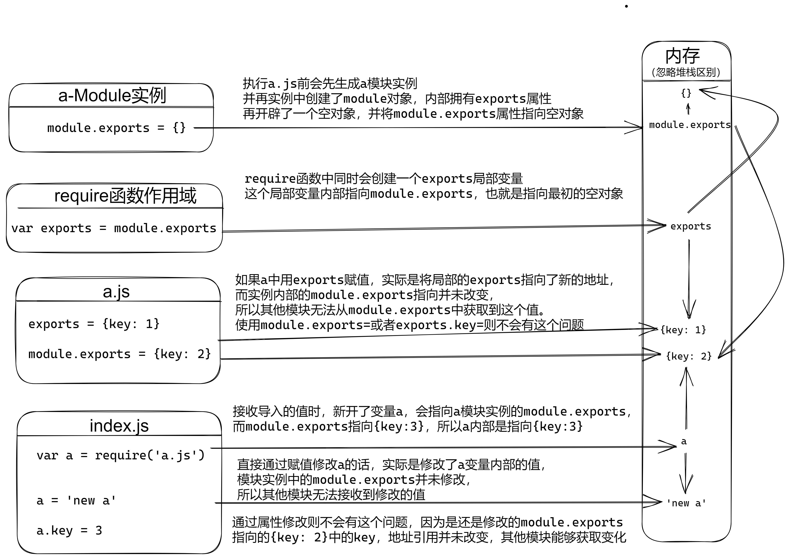

# JS模块化原理

JavaScript在设计之初并没有想到会用于实现复杂的功能，所以没有提供模块化功能。但在逐步的发展中，没有模块化暴露出了很严重的问题：

1. 命名冲突

`HTML`中通过`script`标签加载每个脚本，并按顺序执行。所以需要十分小心脚本中的变量名是否与其他脚本冲突

1. 不利于代码拆分

当代码量增加时，拆分文件很有必要。但`script`标签加载的方式要求每个脚本的书写顺序必须正确，一旦脚本数量增加，会带来很重的心智负担

<hr />

为了解决这些问题，涌现过一系列的模块化方案，可以阅读[The Evolution of JavaScript Modularity](https://github.com/myshov/history-of-javascript/tree/master/4_evolution_of_js_modularity)或[译文](https://github.com/Yingkaixiang/evolution-of-js-modularity)了解JS模块化发展历史。本文仅介绍立即执行函数和如今使用的`CommonJS`、`ESModule`

## 立即执行函数

> 英文全称`Immediately Invoked Function Expression`，简称`IIFE`

通过JS的函数作用域实现模块化是早期最为流行的一种方案，这也是为什么面试几乎必问闭包的原因，算是一种历史传承

```js
;(function(){
  // 脚本逻辑
  // 函数内的变量在其他脚本中无法访问，不会造成作用域污染
})()
// 或者
var someMethod = (function(){  })();
```

这就实现了最为经典的模块化方案，其中第一个分号是因为通过`script`标签加载多个脚本时，前面的脚本可能没有写分号结尾，这就会导致JS解析为`(第一个脚本)()(第二个脚本)`的格式，也就是说第二个脚本的括号被当作了函数调用的括号

后来这种以分号开头，结尾不写分号的立即执行函数格式成了很多程序员默认的规范写法

## CommonJS(CJS)

`CommonJS`是`NodeJS`采用的模块化规范（现在也支持`ESModule`）

### 语法

::: code-group
```js [导出]
module.exports = {
  name: 'value'
}

// 也可以直接使用exports
exports.name = 'value'
```

```js [导入]
const lib = require('./lib.js');
console.log(lib.name) // 打印 value

// 对于不需要接收值的模块，可以只导入
require('./lib.js')
```
:::

### 原理

下面模拟一下`CommonJS`实现模块化的大致原理（仅帮助理解执行流程，与真正的实现方式有差异）。假设拥有如下两个模块：

::: code-group
```js [index.js]
const a = require('./a.js')

console.log(a)
```

```js [a.js]
module.exports = 'a'
```
:::

可以将`CommonJS`看作是一个构建插件，会将上面的两个模块处理成如下的格式：

```js
// Module类
function Module(){
  this.exports = {}
  // 省略类初始化参数及其他初始化属性
}
// 设置缓存对象
Module._cache = {}
// 挂载原型方法require
Module.prototype.require = function(path){
  // 1.计算绝对路径
  var filename = 计算绝对路径
  // 2.判断是否有缓存
  var cache = Module._cache[filename]
  if(cache) {
    return cache
  }
  // 3.判断是否内置模块
  if(内置模块中存在filename) {
    return 内置模块
  }
  // 4.生成模块实例，存入缓存
  var module = new Module()
  Module._cache[filename] = module
  // 创建module.exports的引用，用于提供exports.key=value的简化写法
  var exports = module.exports
  // 5.加载模块
  var content = 读取脚本内容
  // 6.执行模块
  (function(content, exports, require, module) {
    // 模块代码被包装到拥有exports、require、module的函数中执行
    // 所以模块中能够直接使用这三个变量
    // 通过module.exports=导出的对象也就存储到了该模块实例的exports属性中
    // 其他模块再require该模块时，即可从第2步返回的缓存实例对象中获取exports
    // eval是执行代码字符串的方法，参考https://developer.mozilla.org/zh-CN/docs/Web/JavaScript/Reference/Global_Objects/eval
    eval(content)
  })(content, module.exports, Module.prototype.require, module)
}
// 调用入口模块
Module.prototype.require('./index.js')
// 运行到入口中的require('./a.js')时，又会构建a.js的Module实例，并执行a.js代码
// 整个过程是逐行的方式同步执行全部脚本
```

从上面的伪代码可以观察到`CommonJS`的几个特点：

1. `require`加载模块是同步执行的（运行到`require`那一行才会执行对应的模块）
2. 模块只有在第一次被加载时才会执行，后续加载都是读取的缓存
3. 通过模块路径读取缓存，如果路径不同会重新加载（`NodeJS`中支持`URL`格式的路径，所以添加`?key=value`等符号会使同一个模块重新加载）
4. 如果未导出任何值，`require`返回的是初始化的`exports`空对象
5. `module.exports`导出的就是等号接收的值（浅拷贝），对象类型的值各模块可以通过引用共享，简单值则不会互相影响
6. 虽然`exports`和`module.exports`是同一个对象，但不推荐直接使用`exports`。因为`exports`只能用挂载属性的方式导出：`exports.key = value`，如果误写为`exports = value`的形式，只是改写了`exports`变量的值，而真正的`module.exports`属性并未接收到值

关于浅拷贝，可以根据这张图理解:



### 模块匹配规则

`CommonJS`导入`JSON`文件会将文件中的内容解析后导入

```js
// 例如json文件内容为：{"a":"a"}，被导入时就相当于
module.exports = { "a": "a" }
```
`CommonJS`模块解析策略中除了`.js`、`.json`、`.node`之外的扩展名，其他文件均会视为`js`文件进行处理

未找到与传入路径完全匹配的模块时，会依次尝试添加`.js`、`.json`、`.node`扩展名进行匹配

::: tip CommonJS详细的加载顺序为：
使用相对或绝对路径导入时
1. 判断是否有完全匹配路径的文件
2. 依次尝试`.js`，`.json`，`.node`扩展名进行匹配（路径无扩展名则添加扩展名，路径本身有扩展名则修改扩展名）
3. 尝试寻找同名文件夹（去掉扩展名）
4. 如果有同名文件夹，且内部有`package.json`文件和正确的`exports`字段，尝试解析其指定规则的文件（没有与规则路径完全匹配的文件时，前面的规则仍适用）
5. 如果没有正确的`exports`字段，但有正确的`main`字段，尝试加载`main`字段对应的文件（没有与规则路径完全匹配的文件时，前面的规则仍适用）
6. 如果有同名文件夹，但没有`package.json`或`exports`、`main`字段均不正确，在文件夹中按第二条规则尝试查找`index`文件

直接通过包名导入时（`require('package')`），会查找当前目录或最近上级目录中的`node_modules`文件夹，然后再根据上诉规则在`node_modules`文件夹中查找

如果均匹配失败，报错`Cannot find module`
:::

### 循环加载规则

::: code-group
```js [a.js]
var b = require('./b.js')
console.log(b) // b
module.exports = 'a'
```

```js [b.js]
var a = require('./a.js')
console.log(a) // {}
module.exports = 'b'
```
:::

当出现如上的循环引用时，`CommonJS`的处理比较特殊：

`a`执行时，第一行是加载`b`，此时`a`会停住，开始执行`b`

`b`又导入了`a`，但是`a`不会被重复加载，因为模块判断`a`已经被执行过了，缓存中`a`的值是已被执行的部分，也就是没有导出，所以打印为`module.exports`初始的空对象`{}`

等`b`执行完毕，再将执行权交回到`a`，这时导入的`b`取到了值，所以打印就为`b`

**但需要注意的是，语言特性中的函数提升会早于`require`读取，所以循环引用中写在`require`后的`function`声明还是会先被加载**（`var`也会提升，但未赋值前都是`undefined`所以没什么影响）

## ES Module

> 全称`EcmaScript Module`，是官方在`ES6`中推出的标准模块化方案，无论是`Node`端还是浏览器端，基本已全面支持

### 语法

导出：

```js
// 直接导出变量、函数，let、var同理
export const key = value
export function func() {}

// 先声明变量再导出
const key = value
function func(){}
export { key, func }

// 导出重命名
export { key as otherKey, func as otherFunc}

// 默认导出，一个模块只能有一个默认导出，具名导出可以有多个，且可以和默认导出同时拥有
export default value
```

导入:

```js
// 导入非默认导出的变量
import { key, func } from 'module'

// 导入重命名
import { key as otherKey, func as otherFunc} from 'module'

// 整体导入，通过obj.key、obj.func调用
import * as obj from 'module'

// 导入默认导出的数据，name可以任意取
import name from 'module'

// 重命名默认导出
import { default as otherName } from 'module'

// 导入同时有默认导出和具名导出的数据
import name, { key, func } from 'module'

// 仅执行模块，而不获取任何变量
import 'module'
```

导出导入也支持复合写法，可以简化某些情况的书写：

```js
export { foo, bar } from 'module';
// 可以简单理解为
import { foo, bar } from 'module';
export { foo, bar };

// 同样支持重命名和整体再导出
export { foo as myFoo } from 'module';
export * from 'module';
export * as newName from 'module';

// 默认导出的再导出语法为
export { default } from 'module'
export { default as newName } from 'module'
```

浏览器中也已支持`ESModule`模块，采用异步加载的方式，等同于`script`添加了`defer`关键字，多个`ESModule script`标签同样会按照书写顺序加载和执行。也可以添加`async`关键字，这时候模块会在加载完成时立即执行

```html
<script type="module" src=""></script>
<!-- 等同于 -->
<script type="module" src="" defer></script>
<!-- 添加async时，脚本加载完成时便会立即执行 -->
<script type="module" src="" async></script>
```

::: tip `defer`与`async`的区别是：
`defer`要等到整个页面在内存中正常渲染结束（`DOM` 结构完全生成，以及其他脚本执行完成），才会执行；`async`一旦下载完，渲染引擎就会中断渲染，执行这个脚本以后，再继续渲染。一句话，`defer`是“渲染完再执行”，`async`是“下载完就执行”。另外，如果有多个`defer`脚本，会按照它们在页面出现的顺序加载，而多个`async`脚本是不能保证加载顺序的。
:::

### 原理

`ES6`模块化的思想是静态化，使编译时就能够确定模块间依赖关系，以及输入输出的变量，不同于`CommonJS`需要实际运行到那一行才能确定这些东西。静态化带来的好处是：

- 静态分析可以帮助实现类型检验、`TreeShaking`等实用功能
- 将来官方扩充API时，就不在必须做成全局属性，而可以通过提供模块的方式

浏览器中的`ES`模块，通常采用只用`script`标签加载一个入口模块的方式，再通过模块间的依赖解析依次加载需要的模块。下面用一个简单的`Vue`项目例子，帮助理解`ES`模块解析的过程：

::: code-group
```html
<!-- 省略其他代码 -->
<html>
  <body>
    <div id="app"></div>
    <script type="module" src="./main.js"></script>
  </body>
</html>
```

```js [main.js]
import { createApp } from 'vue'
import App from './App.vue'

createApp(App)
```

```js [App.vue]
import { h } from 'vue'
import str from './config.js'
// template模板形式的vue文件，实际上也是被解析为类似的render函数形式
export default {
  render() {
    return h('div', str)
  }
}
```

```js [config.js]
export default 'xxx'
```
:::

在`HTML`代码解析完毕后，因为识别到`type="module"`，所以引擎会采用异步加载的方式，直接开始下载`main.js`文件

在文件下载结束，且`div#app`被渲染完毕后`main.js`便会被引擎中的`ES`模块解析器解析。解析器会从入口开始下载并解析后续的每一个模块，并收集所有的`import`、`export`，构建模块依赖图（这是在引擎解析过程中完成的，代码还未转换为机器码执行）

收集`export`的同时，会为这些导出的变量开辟存储空间。在所有模块全部解析完成后，会从最后一个完成解析的最底层模块开始以深度优先后续遍历的方式层层往上，将每一个`import`、`export`链接到对应的内存地址中，称为软链接（`linking`）

完成上诉解析步骤后，引擎已经有了完整的模块依赖图，可以开始执行代码

第一句`import { createApp } from 'vue'`会让浏览器开始执行`vue`相关的代码。执行过程中会对`createApp`这个导出变量进行求值，并填充到对应内存地址,因为`import`已链接这个地址，所以模块中能正确获取到`createApp`方法

第二句`import App from './App.vue'`会开始执行`App.vue`文件（正式环境中是被解析后的`js`文件，而不是`.vue`），`App.vue`内部又从`vue`中引入了`h`函数，因为`vue`模块在模块依赖图中标记已被执行，所以会直接取得`h`函数的内存地址，然后开始执行`config.js`

`config.js`中对导出变量进行了赋值，回到`App.vue`中执行，又对`render`函数进行了赋值。最后回到`main.js`开始执行`createApp`函数，`createApp`内部会调用`render`函数，返回执行`h`函数生成的虚拟`DOM`，再由`createApp`挂载到`div#app`上，这就完成了整个应用的执行流程

<hr />

因为`ESModule`是在执行前被`JS`引擎静态分析，所以无法在导入中使用变量，或将导入导出放在逻辑之中：

```js
// 报错，因为if逻辑只在运行中才能确定
if (x === 2) {
  import module from 'module.js';
}
// 导入无法使用变量，只能将导入放在模块最外层，规范为模块顶部
let varName = 'xxx'
import { `${varName}Module.js` } from 'module'
```

`ES`模块中还有一些特性：

1. `ES`模块文件中会自动采用严格模式，严格模式相关规则查看[MDN-严格模式](https://developer.mozilla.org/zh-CN/docs/Web/JavaScript/Reference/Strict_mode)
2. `ES`模块支持顶层`await`（也就是代码最外层，非函数内部也可以使用，会断住模块主流程）
3. 模块中顶层`this`为`undefined`，而不是`window`，可以用这个特性区分模块类型
4. 导入`json`文件需要做断言`import name from './xxx.json' assert { type: 'json' }`，只能使用默认导入的方式，导入数据为`json`解析后的对象

### 模块匹配规则

`ES`模块相比于`CommonJS`，只支持导入`.js`、`.mjs`、`.cjs`、`.json`格式的文件，且模块路径必须完全匹配，包括扩展名。所以`ES`模块匹配规则直接在`CommonJS`上进行精简即可：

使用相对或绝对路径导入时，直接尝试查找完全匹配路径的文件

通过包名导入时（`import 'package'`），会查找当前目录或最近上级目录中的`node_modules`文件夹。如果`node_modules`中有同名文件夹，且内部有`package.json`文件和正确的`exports`字段，尝试解析其指定规则的文件

否则匹配失败，报错`Cannot find package`（在`webpack`等打包器中，会扩展`ESModule`支持`CommonJS`的解析规则，要注意并不是`ES`模块的原生解析规则）

### 循环加载规则

`ESModule`处理循环加载与`CommonJS`有本质的不同。`CommonJS`使用拷贝值，而`ESModule`通过软链接到导出变量的内存地址

```js
// a.mjs
import b from './b.mjs';
console.log('a');
console.log(b);
export default 'a';

// b.mjs
import a from './a.mjs';
console.log('b');
console.log(a);
export default 'b';

// 执行a.mjs的打印结果：
// b
// ReferenceError: a is not defined

// 如果是CommonJS的话，可以结合上文推算下，结果是：
// b
// {}
// a
// b
```

在上面的例子中，`a.js`首先引用了`b.js`，会马上开始执行`b.js`。而`b.js`第一行又是引用`a.js`，这时模块依赖关系中判断`a`已经处理过，所以不会重复执行

然后打印`'b'`，之后再执行打印`a`，因为此时的`a.js`模块中导出语句还未执行，也就是软链接地址中还未赋值，所以无法找到`a`，便会报错（只开辟了空间但未赋值，不同于空间中赋值为`undefined`）

**但与`CommonJS`一样，函数的提升还是会早于`import`的执行**，所以如果把上面的导出换成函数，结果便会不一样

```js
// a.mjs
import b from './b.mjs';
console.log('a');
console.log(b);
export default function(){ return 'a' };

// b.js
import a from './a.mjs';
console.log('b');
console.log(a);
export default function(){ return 'a' };

// 执行a.js的打印结果：
// b
// [Function: default]
// a
// [Function: default]
```

### ES模块中加载CommonJS模块

因为`CommonJS`是同步加载的，而`ES`模块内部支持顶层`await`导致不能被同步加载，所以`CommonJS`并不支持混用`ES`模块。但反过来同步的`CommonJS`代码是能被`ESModule`加载的

因为需要执行才能确定导出值，`CommonJS`模块无法被`ES`模块解析器静态分析，所以只能被整体加载:

```js
// 报错
import { method } from 'commonjs-package';
// 正确
import packageMain from 'commonjs-package';
const { method } = packageMain;
// 也可以再次导出，使支持ES模块单个加载
export { method }
```

`NodeJS`的内置模块是支持指定加载的:

```js
// 整体加载
import EventEmitter from 'events';
// 加载指定的输出项
import { readFile } from 'fs';
```

## 动态加载函数-import()

因为`ES`模块采用软链接的方式，所以这些内存地址是只读的，也就是说无法直接修改导入的变量：

```js
import { a } from 'a.js'
a = 2 // Uncaught TypeError: Assignment to constant variable.
```

为了弥补这个缺陷，在`ES2020`提案中引入了`import()`函数，支持动态加载模块，语法为：

```js
import('./module.js')
// 上面提到的例子也就支持了
if (x === 2) {
  import('module');
}
let varName = 'xxx'
import(`${varName}Module.js`)
```

能看出来，`vue`中的路由懒加载与`vite`中的模块动态加载便是用的`import`函数语法

`import`函数会返回一个`Promise`对象，可以用在任何地方，包括`CommonJS`模块中。因为动态加载的原因，所以`import`函数与被加载模块没有静态链接关系，这点与`import`语句不同

:::code-group
```js [a.js]
const name = require('./b.js')

;(async function () {
  const value = await import(`./${name}.mjs`)
  console.log(value)
})()
```
```js [b.js]
module.exports = 'c'
```
```js [c.mjs]
export default 'ccccccc'
```
:::

执行`node a.js`后会打印`[Module: null prototype] { default: 'ccccccc' }`

`ES2020`中还为`import`属性添加一个元属性`import.meta`，返回当前模块的元信息。具体返回哪些属性，标准没有规定，但至少包含下面两个属性：

1. `import.meta.url`：返回当前模块的`url`路径，如`https://foo.com/main.js`
2. `import.meta.scriptElement`：是浏览器特有的原属性会返回加载模块的`script`标签元素

`import.meta`是可扩展的，通过`import.meta.key = value`的形式扩展属性，整个项目其他`ES`模块中也能访问，例如`vite`中扩展了`import.meta.env`
