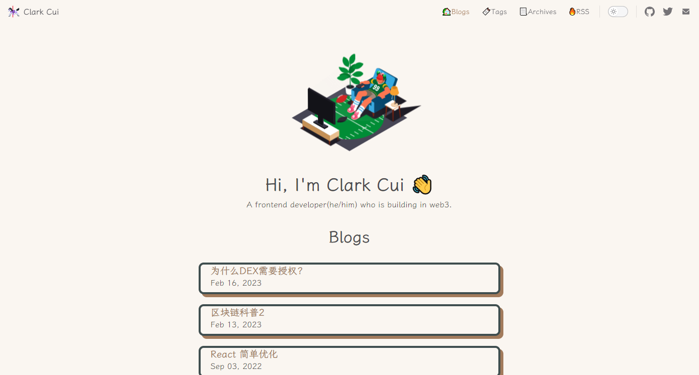
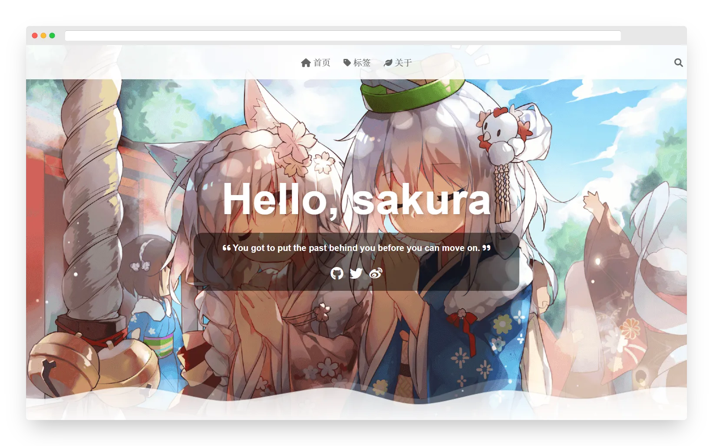

# VitePress 配置解析

## 项目配置

> **页面中可以通过[FrontMatter](/工具系列/VitePress搭建/进阶语法#frontmatter)覆盖配置项**

运行完`npx vitepress init`后会在`.vitepress`文件夹下生成`config.ts`文件，vitepress 基础配置均在此文件中完成

可以结合[官方文档-Reference](https://vitepress.dev/reference/site-config)以及框架提供的`defineConfig` API 查看 TS 类型了解配置项的作用以及格式

这里仅对本项目所用到的配置（也是最常用的配置）进行介绍：

```ts
// .vitepress/config.ts
import { defineConfig } from "vitepress";

export default defineConfig({
  // title、description、lang对应HTML页面head中的对应属性
  title: "Xavi的技术文档",
  description: "个人前端技术文档",
  lang: "zh-cmn-Hans",

  // 属性配置部署时的基础路径，例如部署后路径为http://www.blog.com/xxx/，则需要配置为/xxx/
  base: "/XaviDocs/",

  // 忽略解析部分md文件（默认忽略node_modules），仅打包后生效，被忽略的文件不影响被其他文件导入
  // 使用Glob匹配，语法可以查看http://www.ruanyifeng.com/blog/2018/09/bash-wildcards.html
  srcExclude: [
    "**/(README|TODO).md",
    "(.vitepress|public|images|.guthub|components|snippets)/**/*.md",
  ],

  // 是否展示最近git提交时间
  lastUpdated: true,

  // markdown-it插件配置
  markdown: {
    // 默认显示行号
    lineNumbers: true,
    // 不写语言名时，默认识别为js
    defaultHighlightLang: "js",
  },

  // vite相关配置
  // vite: {
  //   plugins: [],
  // },

  // 项目样式配置
  themeConfig: {
    // 左上方logo
    logo: "/svg/logo.svg",

    // 右上方导航
    nav: [
      {
        text: "前端系列", // 显示名称
        link: "/前端系列/源码阅读/Axios源码解析", // 点击跳转连接
        activeMatch: "/前端系列/", // 正则表达式文本，匹配成功时高亮显示
      },
      // ...
    ],

    // 左侧导航栏，最深支持嵌套六层
    sidebar: {
      // key为正则表达式文本，路径匹配时显示对应的导航栏
      "/前端系列/": [
        {
          text: "源码系列",
          items: [
            { text: "Axios", link: "/前端系列/源码阅读/Axios源码解析" },
            // ...
          ],
        },
        // ...
      ],
      // ...
    },

    // 右侧文章索引级别
    outline: "deep",
    // 右侧索引展示文本
    outlineTitle: "目录",

    // git提交时间展示文本
    lastUpdatedText: "更新时间",

    // 右上方社交链接，提供了预设的icon，也可以自定义填写{ svg: string }
    socialLinks: [
      { icon: "github", link: "https://github.com/Xaviw/XaviDocs" },
    ],

    // 编辑文章的链接，通常提供Github编辑链接
    // 可以进入Github页面，点击文件右上方编辑按钮后获取到编辑链接，:path会自动替换
    editLink: {
      pattern: "https://github.com/Xaviw/XaviDocs/edit/master/:path",
      text: "修改本文",
    },

    // 文章底部切换按钮展示文本
    docFooter: {
      prev: "上一篇",
      next: "下一篇",
    },

    // md 中使用外部链接时展示额外的图标
    externalLinkIcon: true,

    // 移动端切换主题展示文本
    darkModeSwitchLabel: "切换主题",

    // 移动端展示弹出sidebar展示文本
    sidebarMenuLabel: "菜单",

    // 移动端切换语言展示文本
    langMenuLabel: "切换语言",

    // 回到顶部展示文本
    returnToTopLabel: "回到顶部",

    // 搜索功能
    search: {
      // 使用本地搜索
      provider: "local",
      options: {
        // 配置搜索组件展示文本
        translations: {
          button: {
            buttonText: "搜索文档",
          },
          modal: {
            displayDetails: "显示详情",
            noResultsText: "未找到相关结果",
            resetButtonTitle: "清除",
            footer: {
              closeText: "关闭",
              selectText: "选择",
              navigateText: "切换",
            },
          },
        },
      },
    },
  },
});
```

## 首页配置

srcDir 配置（默认根目录）下的`index.md`会作为文档中的首页，可以通过[FrontMatter](/工具系列/VitePress搭建/进阶语法#frontmatter)定义首页中的模板内容

### 布局-layout

支持`doc`、`home`、`page`

- `doc`表示页面使用`md`页面布局
- `home`表示页面使用首页布局，可以添加首页特有的选项
- `page`页面任然会解析`md`，但不会应用任何样式，需要自定义样式
- 设置为`false`可以取消布局，完全自定义页面

将首页`index.md`中的`layout`设置为`home`后，便可以添加下面的`hero`、`features`属性，定义首页内容

设置为`home`后可以继续使用`Vue`代码添加自定义内容，甚至可以通过设置为`page`、`false`完全自定义首页

### 介绍-hero

```md
---
layout: home

hero:
  # 标题上面的文字
  name: XaviDocs
  # 标题
  text: 个人前端技术文档
  # 标题下面的文字
  tagline: 文档持续搭建中，随便逛逛吧...
  # 标题右侧的图片
  image:
    light: svg/pic1.svg
    dark: svg/pic2.svg
  # 标题下方按钮
  actions:
    - text: 开始阅读
      link: /前端系列/源码阅读/Axios源码解析
      # 按钮样式，brand或alt，默认brand
      theme: brand
---
```

image 还支持以下格式：

```md
---
# img 标签 alt 属性，可选
image: xxx

image:
  src: xxx
  alt: xxx

image:
  light: xxx
  dark: xxx
  alt: xxx
---
```

免费图片素材资源在[工具系列-浏览器工具](/工具系列/实用工具/实用浏览器工具#常用网页工具)中有推荐，本站所用的素材是在[iconFont-插画](https://www.iconfont.cn/illustrations/index)中复制的`svg`代码

> `svg`插图可能带有背景色，如果想改为透明，可以查看`svg`代码，找到对应的标签修改或添加`class`并设置`fill:rgba(0,0,0,0);`样式

### 特征-Features

```md
---
layout: home

features:
  # icon可不传
  - icon: 📖
    title: 前端系列
    details: 手把手入门源码阅读、uniapp实用经验...
    # link可不传，传入后hover时会有链接效果
    link: /工具系列/VitePress搭建/基础搭建
    # linkText可不传，为提示跳转的文字
    linkText: 前往查看
  - icon: 🛠️
    title: 工具系列
    details: VitePress文档站点搭建教程、VSCode使用技巧、Windows体验优化...
    link: /工具系列/VitePress搭建/基础搭建
    linkText: 前往查看
---
```

> `Windows`通过快捷键`Win + .`即可打开表情符号选择，也可以在浏览器中搜索后复制使用

### 效果

上面的代码会得到如下效果，除了官方提供的配置样式，后面还介绍了自定义主题配置方式


## 主题配置

### 自定义主题

新建`.vitepress/theme/index.ts`文件作为项目的主题配置文件

`VitePress`提供了默认主题，在未创建主题配置文件的情况下会直接使用。我们也可以完全自定义主题，或根据默认主题进行修改

```ts
import DefaultTheme from "vitepress/theme";
import type { Theme } from "vitepress";
import Layout from "./Layout.vue";
import CommonComponent from "./CommonComponent.vue";
import OtherTheme from "OtherTheme";

export default {
  // 自定义包裹每一个页面的容器组件
  Layout,

  // 自定义增强功能
  // 参数中的app是项目Vue3 App实例
  // router是路由实例
  // siteData是当前站点的元数据
  enhanceApp({ app, router, siteData }) {
    // 可以在这里注册全局组件
    app.component("CommonComponent", CommonComponent);

    // 默认主题中设置了全局组件Badage，如需使用可以执行默认主题中的该方法
    DefaultTheme.enhanceApp({ app, router, siteData });
  },

  // 可以继承其他样式
  extends: OtherTheme,
} as Theme;
```

Layout 组件必须包含一个 `<Content />` 组件，此外可以完全自定义页面逻辑

```vue
<script setup>
import { useData } from "vitepress";
import NotFound from "./NotFound.vue";
import Home from "./Home.vue";
import Page from "./Page.vue";

const { page, frontmatter } = useData();
</script>

<template>
  <h1>Custom Layout!</h1>

  <!-- 判断页面不存在时，自定义渲染404页面 -->
  <NotFound v-if="page.isNotFound" />

  <!-- 判断frontmatter渲染首页 -->
  <Home v-if="frontmatter.layout === 'home'" />

  <!-- 必须定义的默认内容展示 -->
  <Content v-else />
</template>
```

不需要完全自定义主题时，我们也可以通过扩展默认主题的方式修改项目样式

```vue
<template>
  <Layout>
    <template #not-found>
      <NotFound />
    </template>
  </Layout>
</template>

<script lang="ts" setup>
import DefaultTheme from "vitepress/theme";
import NotFound from "./NotFound.vue";

const { Layout } = DefaultTheme;
</script>
```

上面代码在默认主题基础上，自定义了 404 页面。除此之外默认主题还提供了部分关键位置的插槽，可以在[官网-扩展默认主题](https://vitepress.dev/guide/extending-default-theme#layout-slots)中查看

### 自定义样式

默认主题中颜色等样式使用的`CSS`原生变量定义，可以通过重写变量或者重写样式类的方式自定义样式

例如新建`customize.css`文件(文件名可以任取)：

```css
/* .vitepress/theme/customize.css */
:root {
  --vp-home-hero-name-color: transparent;
  --vp-home-hero-name-background: linear-gradient(
    135deg,
    #43cbff 10%,
    #9708cc 100%
  );

  --vp-home-hero-image-background-image: linear-gradient(
    135deg,
    #ee9ae5 10%,
    #5961f9 100%
  );
  --vp-home-hero-image-filter: blur(100px);
}
```

默认主题详细的`CSS`变量以及类可以在[源码仓库](https://github.com/vuejs/vitepress/tree/main/src/client/theme-default/styles)中查看，变量定义在`vars.css`中

> 渐变色可以在[CoolHue 2.0](https://webkul.github.io/coolhue/)中查找

上面的代码便是本站首页中重写的样式，定义后在样式配置文件中引入即可覆盖默认样式：

```ts
// .vitepress/theme/index.ts
import DefaultTheme from "vitepress/theme";
import "./customize.css";

export default DefaultTheme;
```

### 使用其他主题

上面介绍了`VitePress`自定义主题的方法，自然能够找到开源的自定义主题

在 GitHub 中搜索[vitepress-theme](https://github.com/search?o=desc&q=vitepress-theme&s=stars&type=Repositories)，并按`starts`排序，能看到开源主题数量还是比较多的

本文发布时 VitePress 还未发布正式版，开源的自定义主题较少，并且因为 VitePress 自身可能还会有较多改动，大多自定义主题需要 Clone 源码后修改使用，可以自行探索。下面放两个开源主题预览图：

1. [vitepress-blog-zaun](https://github.com/clark-cui/vitepress-blog-zaun)



<hr />

2. [vitepress-theme-sakura](https://github.com/flaribbit/vitepress-theme-sakura)


